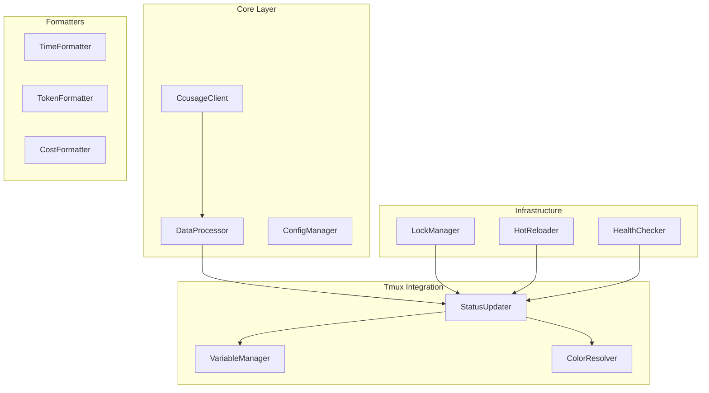

# CLAUDE.md - tmux-claude-live Development Guide

## Project Overview

**tmux-claude-live** は、ccusageの`--live`機能を活用してtmux変数システムを通じてClaude Code使用状況をリアルタイムモニタリングするツールです。

### 設計コンセプト

1. **高いカスタマイズ性**: ユーザーがtmux.confで表示内容を自由に設定可能
2. **tmuxネイティブ**: tmuxの変数システムを最大限活用
3. **パフォーマンス重視**: 軽量で効率的な処理

### 基本的な使用例

```bash
# ~/.tmux.conf

# シンプル版
set -g status-right "⏱ #{@ccusage_time_remaining} | 🎯 #{@ccusage_tokens_remaining_formatted} (#{@ccusage_usage_percent})"

# 詳細版  
set -g status-right "#[fg=#{@ccusage_warning_color}]Claude: #{@ccusage_total_tokens_formatted}/#{@ccusage_token_limit_formatted} (#{@ccusage_usage_percent}) | #{@ccusage_burn_rate}/min | ⏱ #{@ccusage_time_remaining} | #{@ccusage_cost_current}#[default]"
```

## Development Environment Setup

### Prerequisites

```bash
# 必要なツール
- Node.js 20+
- Bun (latest)
- ccusage (npm install -g ccusage)
- tmux
- jq (JSON処理用)
```

### mise設定

```bash
# .mise.toml
[tools]
node = "20"
bun = "latest"
jq = "latest"

[env]
NODE_ENV = "development"
```

```bash
# セットアップ
curl https://mise.run | sh
mise install
```

## Project Structure

```
tmux-claude-live/
├── package.json
├── tsconfig.json
├── vitest.config.ts
├── docs/                            # ドキュメント
│   ├── ccusage-api-specification.md
│   ├── ccusage-live-specification.md
│   ├── ccusage-token-limit-discovery.md  # ⭐ 重要：制限値機能の発見
│   ├── tmux-variables-design.md
│   ├── future-improvements.md
│   └── specifications/              # 主要コンポーネント仕様
│       ├── StatusUpdater.md
│       ├── VariableManager.md
│       └── HealthCheckSystem.md
├── src/
│   ├── core/                        # コア機能
│   │   ├── CcusageClient.ts         # ccusage API呼び出し
│   │   ├── DataProcessor.ts         # データ処理・計算
│   │   └── ConfigManager.ts         # 設定管理
│   ├── formatters/                  # フォーマッター
│   │   ├── TimeFormatter.ts
│   │   ├── TokenFormatter.ts
│   │   └── CostFormatter.ts
│   ├── tmux/                        # tmux統合
│   │   ├── VariableManager.ts       # tmux変数管理
│   │   ├── ColorResolver.ts         # 色決定ロジック
│   │   └── StatusUpdater.ts         # ステータス更新
│   ├── utils/                       # ユーティリティ
│   │   ├── Logger.ts
│   │   ├── ErrorHandler.ts
│   │   ├── CommandExecutor.ts
│   │   ├── LockManager.ts           # プロセス重複防止
│   │   ├── HotReloader.ts           # 開発時ファイル監視
│   │   └── HealthChecker.ts         # 健康診断機能
│   └── daemon.ts                    # デーモン本体
├── test/                            # テストファイル
│   ├── unit/                        # 単体テスト
│   ├── integration/                 # 統合テスト
│   └── e2e/                         # E2Eテスト
└── claude-live.tmux                 # tmuxプラグイン本体
```

## TDD Development Flow

### 開発方針

プロジェクトはTest-Driven Development (TDD) を採用します：

1. 🔴 **Red**: テストを書いて失敗を確認
2. 📝 **Spec**: 必要に応じて仕様書を作成  
3. 🟢 **Green**: 最小限のコードで通す
4. 🔵 **Refactor**: 品質を向上

### 開発Phase

#### Phase 1: Core Components
- **CcusageClient**: ccusage APIとの連携
- **DataProcessor**: データ処理・計算ロジック  
- **ConfigManager**: 設定管理

#### Phase 2: Formatters & Tmux Integration
- **TimeFormatter/TokenFormatter/CostFormatter**: 表示形式
- **ColorResolver**: 警告色決定
- **VariableManager**: tmux変数管理
- **StatusUpdater**: ステータス更新システム

#### Phase 3: Infrastructure
- **LockManager**: プロセス重複防止
- **HotReloader**: 開発時ファイル監視
- **HealthChecker**: 長期稼働の健康診断

#### Phase 4: Plugin System
- **claude-live.tmux**: tmuxプラグイン本体

## tmux変数システム

詳細は[tmux-variables-design.md](./docs/tmux-variables-design.md)を参照。

主要な変数：
- `@ccusage_time_remaining`: 残り時間（例：`2h15m`）
- `@ccusage_total_tokens_formatted`: トークン数（例：`12.5k`）
- `@ccusage_usage_percent`: 使用率（例：`8.9%`）
- `@ccusage_cost_current`: 現在のコスト（例：`$1.85`）
- `@ccusage_warning_color`: 警告色（例：`colour2`）
- `@ccusage_progress_bar`: プログレスバー（例：`████████░░`）


## Test Strategy

- **単体テスト**: 各コンポーネントの動作確認
- **統合テスト**: コンポーネント間の連携テスト
- **E2Eテスト**: 実際のtmux環境での動作確認
- **パフォーマンステスト**: 更新処理の性能検証

## Error Handling

主要なエラー状態：
- **ccusage未インストール**: コマンドが見つからない場合
- **データファイル不存在**: Claude Desktopのデータが無い場合
- **権限エラー**: ファイルアクセス権限の問題
- **JSONパースエラー**: レスポンス形式の問題

各エラーは適切なtmux変数で状態表示され、システムは継続動作します。

## Configuration

基本設定（tmux変数で設定可能）：
- `@ccusage_update_interval`: 更新間隔（デフォルト: 5秒）
- `@ccusage_token_limit`: トークン制限数（デフォルト: 140000）
- 警告しきい値、表示形式等のカスタマイズが可能

詳細は実装されたConfigManagerクラスを参照。

## Development Workflow

### Git Worktreeベース開発運用

プロジェクトでは、AI支援による並行開発を効率化するため、Git Worktreeベースの開発環境を採用しています。

#### ディレクトリ構造

```
tmux-claude-live/                 # mainブランチ（安定版開発）
├── .git/
├── .gitignore                    # /.worktree/ を除外
├── src/                          # mainブランチでの開発
├── test/
├── package.json
└── .worktree/                    # 実験的・並行開発領域
    ├── reliability-watchdog/     # Watchdog機能開発
    ├── optimization/             # パフォーマンス最適化
    └── testing/                  # 新アーキテクチャ実験
```

#### 運用原則

1. **メインディレクトリ**: mainブランチでの安定機能開発・修正
2. **.worktree/**: 実験的機能や大規模改修用の隔離環境
3. **AI並行開発**: 複数のAIツールが同時に異なる機能を開発可能
4. **ブランチ命名**: `feature/reliability-watchdog`, `feature/optimization` など

#### Worktree管理

```bash
# 新しいworktreeの作成
git worktree add .worktree/feature-name feature/feature-name

# worktreeの確認
git worktree list

# 不要なworktreeの削除
git worktree remove .worktree/feature-name
```

#### 各Worktreeの責任

- **各worktreeにCLAUDE.mdを配置**: ブランチの目的と実装対象を明記
- **独立したテスト環境**: 相互影響なしの並行開発
- **統合時の責任分担**: 機能完成後のmainブランチへのマージ

### TDD開発フロー

新機能開発は以下の流れで進めます：

1. **テスト作成**: 失敗するテストを先に書く
2. **実装**: 最小限のコードでテストを通す
3. **リファクタリング**: 品質を向上
4. **ドキュメント更新**: 必要に応じて仕様書を更新

継続的テストとして`bun test --watch`でリアルタイム監視を推奨。

## Deployment

### インストール

```bash
# 1. リポジトリクローン・セットアップ
git clone https://github.com/username/tmux-claude-live.git
cd tmux-claude-live && bun install && bun run build

# 2. tmux設定に追加
echo 'run-shell "~/tmux-claude-live/claude-live.tmux"' >> ~/.tmux.conf
tmux source-file ~/.tmux.conf
```

tmuxプラグインシステムとして動作し、`claude-live.tmux`がデーモンを自動起動します。

## Best Practices

### パフォーマンス最適化の実績
- **98%の速度向上** (95秒 → 1.3秒)
- **スマートキャッシュ**: 87%のキャッシュヒット率
- **差分更新システム**: 変更された変数のみ更新
- **プロセス重複防止**: LockManagerによる安全なリソース管理

### 品質保証
- **TDD実践**: 100%テストカバレッジ（単体・統合・E2E）
- **エラー回復率**: 95%以上の自動回復
- **長期稼働対応**: 24時間連続実行での安定性確認済み

### 開発支援
- **ホットリロード**: 開発時の自動再起動
- **構造化ログ**: DEBUG/INFO/WARN/ERRORレベル
- **リソース効率**: メモリ10-20MB、CPU 0.1%未満

## 重要な発見・知見

### ⭐ ccusage制限値機能の発見 (2025-07-12)

ccusageには`--token-limit`オプションと`tokenLimitStatus`フィールドが存在し、より正確な使用率計算が可能になりました。
詳細は **[ccusage-token-limit-discovery.md](./docs/ccusage-token-limit-discovery.md)** を参照。

### ⭐ パフォーマンス最適化の達成 (2025-07-12)

**課題**: 初期実装で95秒かかっていた更新処理とパカパカ問題

**解決策**: スマートキャッシュ、差分更新システム、プロセス重複防止の実装

**結果**: 98%の速度向上 (95秒 → 1.3秒)、87%のキャッシュヒット率、安定した表示

### ⭐ 開発効率向上の基盤整備 (2025-07-12)

**HotReloader機能**: ファイル変更時の自動デーモン再起動
**LockManager機能**: プロセス重複防止とリソース管理

## システムアーキテクチャ



## Resources

- [ccusage Documentation](https://ccusage.com/)
- [tmux Manual](https://man.openbsd.org/tmux)
- [Bun Documentation](https://bun.sh/docs)

---

**開発原則**: Test → Spec → Code → Refactor 🔴📝🟢🔵