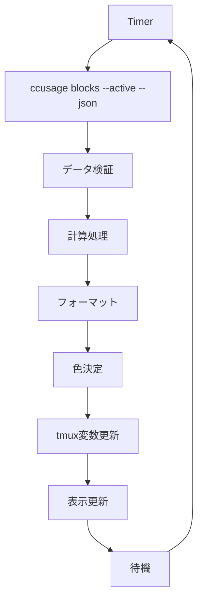

# tmux変数システム設計仕様書

## 概要

tmux-claude-liveは、ccusageの情報をtmux変数として提供することで、ユーザーが自由にカスタマイズできるClaude Code使用状況モニタリングシステムです。

## 設計コンセプト

### 1. 高いカスタマイズ性
- ユーザーがtmux.confで表示内容を自由に設定可能
- 必要な情報のみを選択して表示
- 複数の表示パターンを簡単に切り替え

### 2. パフォーマンス重視
- 5秒間隔での更新（カスタマイズ可能）
- 軽量なデータ処理
- 必要最小限のリソース使用

### 3. tmuxネイティブ
- tmuxの変数システムを最大限活用
- 標準的なtmux記法に準拠
- 既存のtmux環境と自然に統合

## 提供するtmux変数

### 基本情報

| 変数名 | 型 | 説明 | 例 |
|--------|-----|------|-----|
| `@ccusage_is_active` | boolean | ブロックがアクティブかどうか | `true` / `false` |
| `@ccusage_block_status` | string | ブロックのステータス | `active` / `inactive` / `expired` |
| `@ccusage_remaining_minutes` | number | 残り時間（分） | `45` |
| `@ccusage_remaining_seconds` | number | 残り時間（秒） | `2700` |

### 時間表示

| 変数名 | 型 | 説明 | 例 |
|--------|-----|------|-----|
| `@ccusage_time_remaining` | string | 残り時間（フォーマット済み） | `2h15m` |
| `@ccusage_time_remaining_short` | string | 残り時間（短縮形） | `2h` |
| `@ccusage_time_elapsed` | string | 経過時間 | `2h45m` |
| `@ccusage_block_progress` | string | ブロック進捗率 | `55%` |

### トークン情報

| 変数名 | 型 | 説明 | 例 |
|--------|-----|------|-----|
| `@ccusage_total_tokens` | number | 総トークン数 | `12500` |
| `@ccusage_total_tokens_formatted` | string | 総トークン数（フォーマット済み） | `12.5k` |
| `@ccusage_input_tokens` | number | 入力トークン数 | `5000` |
| `@ccusage_input_tokens_formatted` | string | 入力トークン数（フォーマット済み） | `5.0k` |
| `@ccusage_output_tokens` | number | 出力トークン数 | `7500` |
| `@ccusage_output_tokens_formatted` | string | 出力トークン数（フォーマット済み） | `7.5k` |

### 使用率情報

| 変数名 | 型 | 説明 | 例 |
|--------|-----|------|-----|
| `@ccusage_usage_percent` | string | 使用率（%） | `8.9%` |
| `@ccusage_usage_percent_raw` | number | 使用率（生の値） | `8.9` |
| `@ccusage_tokens_remaining` | number | 残りトークン数 | `127500` |
| `@ccusage_tokens_remaining_formatted` | string | 残りトークン数（フォーマット済み） | `127.5k` |
| `@ccusage_token_limit` | number | トークン制限数 | `140000` |
| `@ccusage_token_limit_formatted` | string | トークン制限数（フォーマット済み） | `140k` |

### コスト情報

| 変数名 | 型 | 説明 | 例 |
|--------|-----|------|-----|
| `@ccusage_cost_current` | string | 現在のコスト | `$1.85` |
| `@ccusage_cost_current_raw` | number | 現在のコスト（生の値） | `1.85` |
| `@ccusage_cost_projected` | string | 予測コスト | `$2.10` |
| `@ccusage_cost_projected_raw` | number | 予測コスト（生の値） | `2.10` |
| `@ccusage_cost_per_hour` | string | 時間あたりコスト | `$0.45/h` |
| `@ccusage_cost_per_hour_raw` | number | 時間あたりコスト（生の値） | `0.45` |

### 消費率情報

| 変数名 | 型 | 説明 | 例 |
|--------|-----|------|-----|
| `@ccusage_burn_rate` | string | トークン消費率 | `250/min` |
| `@ccusage_burn_rate_raw` | number | トークン消費率（生の値） | `250` |
| `@ccusage_burn_rate_formatted` | string | トークン消費率（フォーマット済み） | `250` |

### 警告・色情報

| 変数名 | 型 | 説明 | 例 |
|--------|-----|------|-----|
| `@ccusage_warning_level` | string | 警告レベル | `normal` / `warning` / `danger` |
| `@ccusage_warning_color` | string | 警告色（tmux形式） | `colour2` / `colour3` / `colour1` |
| `@ccusage_warning_color_name` | string | 警告色（色名） | `green` / `yellow` / `red` |

### プログレスバー

| 変数名 | 型 | 説明 | 例 |
|--------|-----|------|-----|
| `@ccusage_progress_bar` | string | プログレスバー（10文字） | `████████░░` |
| `@ccusage_progress_bar_20` | string | プログレスバー（20文字） | `████████████████░░░░` |
| `@ccusage_progress_bar_simple` | string | シンプルプログレスバー | `[========= ]` |

### メタ情報

| 変数名 | 型 | 説明 | 例 |
|--------|-----|------|-----|
| `@ccusage_last_update` | string | 最終更新時刻 | `14:30:15` |
| `@ccusage_entries` | number | エントリー数 | `67` |
| `@ccusage_models` | string | 使用モデル | `sonnet,opus` |
| `@ccusage_update_interval` | number | 更新間隔（秒） | `5` |

## 使用例

### シンプル版

```bash
# ~/.tmux.conf
set -g status-right "⏱ #{@ccusage_time_remaining} | 🎯 #{@ccusage_tokens_remaining_formatted} (#{@ccusage_usage_percent})"
```

表示例：
```
⏱ 2h15m | 🎯 127.5k (8.9%)
```

### 詳細版

```bash
# ~/.tmux.conf
set -g status-right "#[fg=#{@ccusage_warning_color}]Claude: #{@ccusage_total_tokens_formatted}/#{@ccusage_token_limit_formatted} (#{@ccusage_usage_percent}) | #{@ccusage_burn_rate}/min | ⏱ #{@ccusage_time_remaining} | #{@ccusage_cost_current}#[default]"
```

表示例：
```
Claude: 12.5k/140k (8.9%) | 250/min | ⏱ 2h15m | $1.85
```

### プログレスバー版

```bash
# ~/.tmux.conf
set -g status-right "Claude [#[fg=#{@ccusage_warning_color}]#{@ccusage_progress_bar}#[default]] #{@ccusage_usage_percent} | #{@ccusage_time_remaining}"
```

表示例：
```
Claude [████████░░] 8.9% | 2h15m
```

### カスタム組み合わせ

```bash
# ~/.tmux.conf
set -g status-right "#[fg=#{@ccusage_warning_color}]●#[default] #{@ccusage_time_remaining} | #{@ccusage_cost_current} | #{@ccusage_burn_rate}/min"
```

表示例：
```
● 2h15m | $1.85 | 250/min
```

## 設定オプション

### 基本設定

```bash
# ~/.tmux.conf

# 更新間隔を設定（デフォルト: 5秒）
set -g @ccusage_update_interval 10

# トークン制限を設定（デフォルト: 140000）
set -g @ccusage_token_limit 100000

# 警告レベルのしきい値を設定（デフォルト: 70, 90）
set -g @ccusage_warning_threshold_1 60
set -g @ccusage_warning_threshold_2 80

# 時間警告のしきい値を設定（デフォルト: 60, 30分）
set -g @ccusage_time_warning_1 90
set -g @ccusage_time_warning_2 45
```

### 表示設定

```bash
# ~/.tmux.conf

# 時間表示形式（デフォルト: "2h15m"）
set -g @ccusage_time_format "compact"  # "2h15m"
set -g @ccusage_time_format "verbose"  # "2 hours 15 minutes"
set -g @ccusage_time_format "short"    # "2h"

# コスト表示形式（デフォルト: "$1.85"）
set -g @ccusage_cost_format "currency"  # "$1.85"
set -g @ccusage_cost_format "number"    # "1.85"
set -g @ccusage_cost_format "compact"   # "1.85$"

# トークン表示形式（デフォルト: "12.5k"）
set -g @ccusage_token_format "compact"  # "12.5k"
set -g @ccusage_token_format "full"     # "12,500"
set -g @ccusage_token_format "short"    # "12k"
```

### 色設定

```bash
# ~/.tmux.conf

# カスタム色を設定
set -g @ccusage_color_normal "colour2"   # 緑
set -g @ccusage_color_warning "colour3"  # 黄
set -g @ccusage_color_danger "colour1"   # 赤
set -g @ccusage_color_inactive "colour8" # グレー
```

## 実装アーキテクチャ

### コンポーネント構成

```
tmux-claude-live/
├── src/
│   ├── core/
│   │   ├── CcusageClient.ts         # ccusage API呼び出し
│   │   ├── DataProcessor.ts         # データ処理・計算
│   │   └── ConfigManager.ts         # 設定管理
│   ├── formatters/
│   │   ├── TimeFormatter.ts         # 時間表示形式
│   │   ├── TokenFormatter.ts        # トークン表示形式
│   │   ├── CostFormatter.ts         # コスト表示形式
│   │   └── ProgressBarGenerator.ts  # プログレスバー生成
│   ├── tmux/
│   │   ├── VariableManager.ts       # tmux変数管理
│   │   ├── ColorResolver.ts         # 色決定ロジック
│   │   └── StatusUpdater.ts         # ステータス更新
│   └── utils/
│       ├── Calculator.ts            # 計算ユーティリティ
│       └── Validator.ts             # データ検証
├── claude-live.tmux                 # tmuxプラグイン本体
└── scripts/
    └── update-variables.sh          # 変数更新スクリプト
```

### 動作フロー

1. **データ収集**: `CcusageClient`がccusage APIから情報取得
2. **データ処理**: `DataProcessor`が必要な計算を実行
3. **フォーマット**: 各種フォーマッターが表示形式に変換
4. **色決定**: `ColorResolver`が警告レベルに応じた色を決定
5. **変数更新**: `VariableManager`がtmux変数を一括更新
6. **表示**: tmuxがユーザー設定に基づいて表示

### 更新サイクル



## エラーハンドリング

### 一般的なエラー

1. **ccusageコマンドが見つからない**
   - 変数を「Inactive」状態に設定
   - エラーメッセージを表示

2. **データファイルが存在しない**
   - 変数を「No Data」状態に設定
   - 適切な警告を表示

3. **JSONパースエラー**
   - 前回の値を保持
   - エラーログを記録

4. **権限エラー**
   - 変数を「Permission Error」状態に設定
   - 解決方法を提示

### エラー状態の表示

```bash
# エラー状態の表示例
@ccusage_block_status = "error"
@ccusage_error_message = "ccusage command not found"
@ccusage_warning_color = "colour1"  # 赤
```

## テスト戦略

### 単体テスト

- 各フォーマッターのテスト
- 計算ロジックのテスト
- 色決定ロジックのテスト

### 統合テスト

- ccusage APIとの連携テスト
- tmux変数更新のテスト
- エラーハンドリングのテスト

### E2Eテスト

- 実際のtmux環境での表示テスト
- 設定変更の動作確認
- パフォーマンステスト

## パフォーマンス最適化

### 効率的な更新

1. **差分更新**: 変更があった変数のみ更新
2. **キャッシュ**: 計算結果をキャッシュして再利用
3. **バッチ処理**: 複数の変数を一括で更新

### リソース管理

1. **メモリ使用量**: 最小限のメモリ使用
2. **CPU使用量**: 軽量な計算処理
3. **ディスクI/O**: 必要最小限のファイル読み込み

## 今後の拡張

### 将来的な機能

1. **プラグインシステム**: カスタムフォーマッターの追加
2. **通知機能**: 警告レベル到達時の通知
3. **履歴機能**: 過去の使用状況の表示
4. **統計情報**: 詳細な使用統計の提供

### 他ツールとの連携

1. **他のステータスバーツール**: polybar、i3status等
2. **ログ出力**: syslog、journald等
3. **外部API**: Slack、Discord等への通知

この設計により、柔軟で高性能なtmux統合システムを実現できます。